	[Entre crochers ce sont des commentaires de work in progress]

#####Avant propos
_Ce mémoire a été rédigé en _Markdown_. Il s'agit d'un langage de balisage, c'est à dire une syntaxe web comme l'est _Html_ par exemple. Les balises _html_ ou _Markdown_ sont des bouts de codes qui donnent des instructions (de formatage) aux ordinateurs pour hiérarchiser le texte : indiquer par exemple les zones en italique, les titres ou les retours à la ligne. Markdown est un outil de conversion du texte vers le html. Il a été créé pour permettre à l'utilisateur d'écrire facilement et de lire facilement un texte qui sera ensuite automatiquement généré en code _html_. Un document _Markdown_ peut être publié tel quel, sans donner l'impression d'être du code informatique. J'ai utilisé le logiciel _Mou_ comme traitement de texte. Il y a d'un côté le texte en _Markdown_ avec les balises visibles et de l'autre le texte avec le style appliqué. Ce langage me permet d'être fluide dans le traitement du texte. Je hiérarchise les informations, _titre_ ou _sous-titre_ par exemple et je choisirai, par la suite, leurs styles graphiques (couleur, taille..) avec une feuille de style CSS. Je peux donc utiliser ce texte, à la fois pour un document imprimé et pour un usage web ; il est compris à la fois des humains et des machines. Ce langage me permet d'agir de manière fluide sur la forme de mon texte._

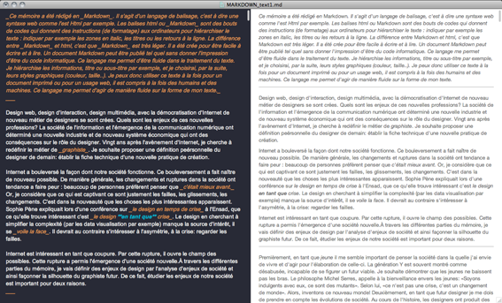  
Capture d'écran du logiciel Mou

#Memoire : Design Fluide
___

##Introduction

#####Designer la société fluide

Design web, design d'interaction, design multimédia, avec la démocratisation d'Internet des nouveaux métiers de designers se sont créés. Quels sont les enjeux de ces nouvelles professions? La société de l'information et l'émergence de la communication numérique ont déterminé une nouvelle industrie et de nouveaux systèmes économiques qui ont des conséquences sur le rôle du designer. Vingt ans après l'avènement d'Internet, je cherche à redéfinir le métier de _graphiste_. Je souhaite proposer une définition personnelle du design de demain: établir la fiche technique d'une nouvelle pratique de création.

Internet a bouleversé la façon dont notre société fonctionne. Ce bouleversement a fait naître de nouveaux possibles. De manière générale, les changements et ruptures dans la société ont tendance à faire peur : beaucoup de personnes préfèrent penser que _c'était mieux avant_. Or, je considère que ce qui est captivant ce sont justement les failles, les glissements, les changements. C'est dans la nouveauté que les choses les plus intéressantes apparaissent. Sophie Pène expliquait lors d'une conférence sur _le design en temps de crise_ à l'Ensad, que ce qu'elle trouve intéressant c'est _le design **en tant que** crise_. Le design, en cherchant à simplifier la complexité (par les data visualisations par exemple), manque la source d'intérêt, il se _voile la face_. Il devrait, au contraire, s'intéresser à l'asymétrie, à la crise: regarder les failles.

Internet est intéressant en tant que coupure. Par cette rupture, il ouvre le champ des possibles. Cette rupture a permis l'émergence d'une société nouvelle. À travers les différentes parties de ce mémoire, je vais définir des enjeux de design par l'analyse d'enjeux de société et ainsi façonner la silhouette du graphiste futur. De ce fait, étudier les enjeux de notre société est important pour deux raisons.
___

Premièrement,  en tant que _jeune_, il me semble important de penser la société dans laquelle j'ai envie de vivre et d'agir pour l'élaboration de celle-ci. La génération Y est souvent montrée comme désabusée, incapable de se figurer un futur viable. Je souhaite démontrer que les jeunes ne baissent pas les bras. Le philosophe Michel Serres, appelle à la bienveillance envers les jeunes: «Soyons indulgents avec eux, ce sont des mutants». Selon lui, «ce n'est pas une crise, c'est un changement de monde». Alors, inventons ce nouveau monde!
Deuxièmement, en tant que futur designer, je me dois de prendre en compte les évolutions de société. Au cours de l'histoire, les designers ont produit des formes en adéquation avec les innovations techniques et sociales. Proche des préoccupations de son époque, le créateur propose des solutions innovantes qui portent la société vers un futur adapté. Ses propositions se doivent de modeler la société, de la guider vers une réalisation d'elle même complète et intelligente. Ainsi, les enjeux de design se définissent par des enjeux de société. Le designer _produit_ ou _industriel_ a joué un rôle important au cours du XXe siècle pendant l'industrialisation. En effet, le designer produit se devait de comprendre les évolutions industrielles de son époque: rationalisation, réduction du coût de production, motorisation ainsi que les évolutions sociales : économie du progrès par la consommation, démocratisation des congés, émergence d'une classe moyenne...

Nous pouvons penser par exemple à Charlotte Perriand qui proposa _une salle de séjour à budget populaire_ il s'agit d'un développement de mobilier accessible au classes moyennes qui sont alors touchées par la crise. Le designer intègre les problématiques de son temps dans son travail pour proposer une réponse singulière.

Aujourd'hui, la circulation des informations a été transformée par le numérique et les nouvelles technologies de l'information et de la communication. Nous sommes passés de la société de consommation à la société de l'information, le graphiste, en tant que designer visuel de communication ou de culture, occupe une place stratégique dans cette révolution. Par ailleurs, le web est une partie très importante d'Internet, il s'agit de l'ensemble des pages web et des hyperliens qui les relient. Elle est généralement définie comme étant "la partie graphique" d'Internet. Il me semble que cette caractéristique nous révèle l'importance de cet espace pour les graphistes. Aujourd'hui, il me semble que la position du design dans notre société actuelle n’est pas clairement définie. Si le rôle de l'ingénieur, de l'économiste ou du conseiller en marketing sont inaltérables et immuables, celui du design est perpétuellement remît en question. Nous devons donc préciser son rôle.

De la même manière que le designer objet a eu une position stratégique pendant la révolution industrielle et la société de consommation du XXe siècle, le designer graphique a aujourd'hui une position centrale dans la société de l'information. Il peut agir à la fois sur des enjeux de société et des enjeux de design. Ainsi, à la fois en tant que _jeune_ et futur graphiste je souhaite formuler une proposition d'avenir: designer une société fluide. 
___

#####De la société fluide au Design fluide

Le terme de "fluide" est emprunté à l'auteur Joël de Rosnay, il est le premier à définir la société comme fluide dans son livre _Surfer la vie: Vers la société fluide_. L'auteur nous explique comment nous sommes en train de passer d'une société solide à une société fluide.

La société solide est une société héritée du capitalisme et de la société de consommation ; elle fonctionne selon des rapports de forces et des hiérarchies. Les entreprises, les organisations, les gouvernements s'organisent de manière pyramidale, une tête dirigeante qui contrôle la base de la pyramide. Les entreprises entre elles fonctionnent selon des rapports de force, l'économie actuelle est en partie fondée sur une volonté de compétition. D'un point de vue géopolitique ce sont les mêmes rapports : les pays du "nord économique" exercent une puissance sur les pays du sud. Les relations entre les différents pays sont en tension, chaque pays défend sa position à travers des relations internationales complexes. Ainsi les états défendent leurs territoires et dans certains cas cherchent à en conquérir de nouveaux. La société solide est fondée sur un système compétitif entre les états, les entreprises, mais aussi entre les citoyens. C'est une course continuelle en quête de puissance et de reconnaissance.

Or Internet, par sa forme réticulaire, entre en contradiction avec les systèmes verticaux, il favorise l'égalité entre les individus. Les internautes peuvent s'organiser librement entre eux sans avoir recours à une coordination supérieure. Le web de par sa forme décentralisée et son réseau libre et neutre, encourage l'égalité entre les utilisateurs. Internet a permis d' "aplanir les organisations, mondialiser la société, décentraliser l'autorité et favoriser l'harmonie entre les êtres humains." (Fred Turner) En permettant des échanges horizontaux et des organisations transversales, les hiérarchies pyramidales n'ont plus de légitimité sur Internet. "La forme participative d’Internet rompt avec l’aspect pyramidal de société humaine" explique Joël de Rosnay.

C'est grâce à ce potentiel d'organisation originale que la société fluide se fonde sur des principes tels que le partage et la collaboration, l'auto-organisation, l'intelligence collective, la transparence et des engagements dans un Internet libre. T. Crouzet reconnait que "les structures sociales traditionnelles paraissent trop rigides, trop statiques, trop centralisées et inflexibles." La société fluide privilégie la relation, Joël de Rosnay parle de l'émergence d'une intelligence _connective_, _collaborative_ et _collective_ sur Internet. C'est l'avènement d'une société nouvelle conçue par une génération numérique enthousiaste, autosuffisante, dotée d'un système de représentation personnelle qui s'organise à l'instar du réseau lui-même: "en réseau collaboratifs de pairs indépendants." 

De plus, Zygmunt Bauman évoque dans _Liquid Modernity_ de nouveaux systèmes de pouvoir basés sur des idées plus "mobiles, glissantes, fuyantes, évasives et fugitives" ("mobile, slippery, shifty, évasive and fugitive") et il affirme que dans "les temps de modernités fluides les choix individuels s'imbriquent dans des projets et des actions collectives" ("The time of fluid modernity, are the bonds which interlock individual choices in collective projects and actions."
___

**Nous sommes en train de passer d'une société solide, basée sur des rapports de force, des hiérarchies pyramidales, à une société fluide basée sur l'échange et la transversalité. Quel design pouvons-nous envisager pour demain à partir des enjeux de la société fluide ?**
___

Joël de Rosnay dans la vidéo, _les quatre Web_, développe les évolutions successives d'Internet. Le premier web, 1.0, est un web uniquement spatial, ce sont des documents hébergés sur des pages web. Le Web 2.0, celui que nous connaissons aujourd'hui, amène une idée d'espace-temps. Les sites sont devenus des plateformes. Sur une page unique, les informations se chargent sous la forme de flux en constante évolution. Le flux augmente, diminue. En rechargeant la page, les éléments changent, se mettent à jour. Par exemple, avec une plateforme comme _twitter_, le flux d'actualité évolue en permanence. J'ai compris que le design devenait fluide par cette évolution entre le web 1.0 et le web 2.0. Après avoir admis que la société devenait fluide, je me suis rendue compte que le design de la même façon devenait, lui aussi, fluide. Internet est un media fluide et il a fluidifié la société mais aussi le design. Ces observations personnelles ont été validées par un article du designer Gilles de Brock qui remarque, que si Internet n'a pas d'état solide, dans quel état se trouve t-il? Dans un état liquide ? ("But if internet knows no solid state which state does it have then? Maybe liquid?")
___

Nous allons chercher à définir ce qu'est un design fluide. Le design fluide ne possède pas de formes fixes, il est en changement constant; en opposition avec un design solide, qui a une forme figée dans le temps, une fois produites ou imprimées elles sont immuables. Le design fluide est un design réactualisé, il est dans un éternel changement, augmenté par des flux d'informations.

Ainsi, le design graphique tel que nous l'imaginons est un design solide, il s'agit de composer des affiches, des flyers, des livres. Ces objets une fois produits sont figés dans l'espace. Le principal paramètre de création du design solide est l'**espace**. Créer une affiche ou un livre, c'est composer, positionner des éléments les uns par rapport aux autres dans un espace. Le design règle les distances entre les composants. Il choisit la taille de la marge, la taille des images, le nombre, l'orientation... Le design solide est un travail de composition dans l'espace.

Or, le design fluide est augmenté de nouveaux paramètres. Le premier paramètre qui rend le design fluide c'est le temps. Designer un produit pour le web, c'est créer des formes mobiles et liquides qui évolueront dans le temps. Ainsi le designer doit prévoir dans son travail ces fluctuations d'information. Le designer doit prendre en compte les futures mises à jour de son client. Si nous prenons l'exemple d'un portfolio pour un photographe, le client voudra ajouter de nouveaux projets par la suite, en supprimer, changer les textes. Cependant, le projet qu'il souhaitera ajouter sera peut-être plus long que les autres, au lieu de 4 images verticales, il en aura 20 horizontales. Un design fluide est un design qui prend en compte les évolutions dans le temps. Un design fluide n'a pas de forme fixe dans le temps, Internet est un media de la réactualisation, de l'instantanéité.

Jonathan Puckey du studio _Moniker_ a réalisé un projet qui souligne et rend visible ces évolutions de contenu au cours du temps. Il s'est intéressé à la fluctuation des informations. _The Quick Brown_ est un site qui affiche les évolutions successives des gros titres d'actualité des sites d'informations. Par des ratures visibles, il montre les modifications. En effet, Internet étant un media qui permet la mise à jour en permanence, les rédacteurs des sites d'informations apportent des retouches au texte, légères ou radiales, en fonction de l'évolution de l'actualité. Ce projet souligne ainsi l'aspect fluide d'internet. Cette idée du titre immuable tel que nous le connaissons dans les medias solides (journaux, livre..) se trouve métamorphosé en une forme fluide et adaptable.

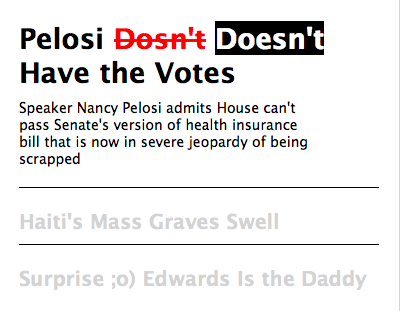

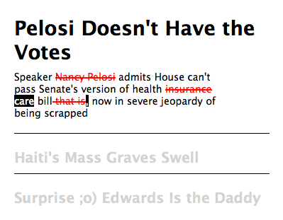

_Capture d'écran du projet **The Quick Brown** de Jonathan Puckey du studio **Moniker**_
___

#####Les trois facette de la Société Fluide

Dans mon mémoire, je souhaite approfondir la notion de société et de design fluide. Je souhaite mettre en relation les enjeux de la société fluide avec des enjeux de design fluide. Le profil de la société fluide peut se définir selon trois faces : c'est à partir de ces trois axes que nous allons envisager le profil du design de demain. Ainsi, nous allons mettre en relation des enjeux de design avec des enjeux de société. 

La première face de la société fluide se base sur l'idéologie du partage et de la contribution, cela se base sur la capacité de copie et de modification des objets sur Internet. Nous allons voir comment le design fluide s'adapte à ce nouveau système de création et de participation par la copie, en étudiant notamment l'open source et l'importance des biens communs dans la société fluide.

La seconde face de la société fluide émerge de l'intelligence collective et de l'auto-organisation possible entre les individus grâce à Internet. Nous allons voir dans cette partie comment cette intelligence collective permet l'élaboration d'un langage fluide et ainsi comment la communication se transforme en propagation virale des informations sous la forme de _mème_.

La dernière face de cette société réside dans l'augmentation des capacités cognitives des individus notamment par l'émergence d'une nouvelle couche de connexion à la surface d'Internet: le web sémantique. Nous allons chercher à comprendre comment le web sémantique permet une transformation des ressources de connaissances pour les Hommes. Nous observerons l'influence des métalangages et des métadonnées sur l'information et nous montrerons l'émergence de la diversité et de la personnalisation des informations sous forme d'écosystèmes informationnels. Ainsi, nous questionnerons l'utilisation des métadonnées et nous verrons en quoi le designer graphique se doit d'accompagner l'émergence de ces nouveaux outils de cognition.

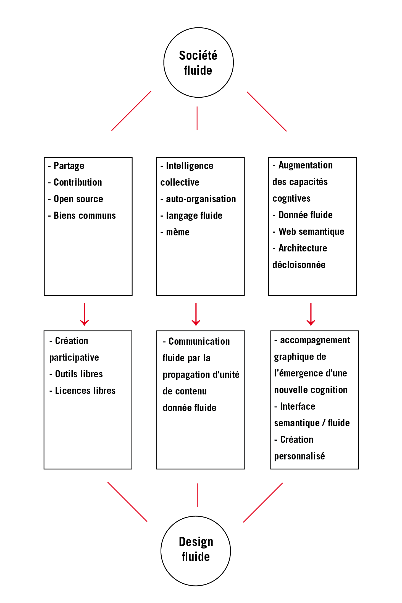

_Schéma des trois faces de la société fluide et leurs conséquences sur le design fluide_

___

## 1. De la copie à la contribution : nouveaux enjeux de création fluide

#####Internet un espace de partage et de contribution

D'une part, la copie est l'une des fonctions fondamentales d'Internet. Nous pouvons dupliquer textes, images, codes avec une réelle facilité. Ces fonctionnalités sont à la base d'Internet et en sont les premières raisons de sa fluidité. La culture Internet s'est formée à partir de cette liberté de copie, de piratage ou de téléchargement. L'industrie de la musique a été entièrement transformée par ce simple fait de pouvoir la copier numériquement. C'est une idéologie très forte sur Internet, elle a été reprise par de grands groupes marketing comme Apple qui aura comme slogan "Rip, Mix, Burn" qui signifie "Copie, Mix, Grave".

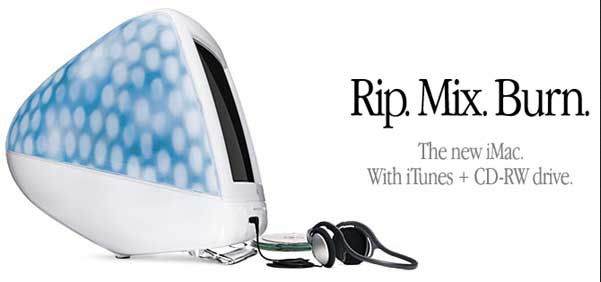
_Publicité Apple_

D'autre part, Internet est un espace commun à l'échelle mondiale, c'est à dire qu'il autorise l'échange entre les individus à travers le monde sur une plateforme unique. Internet permet de parler à la planète entière, de s'organiser, de trouver ou de diffuser de l'information. Il permet de défier le monde entier. Boris Beaude explique cette caractéristique spatiale dans _Internet, changer l'espace. Changer la société_. Il définit cette particularité sous le terme de _synchorisation_. Il explique que la _synchorisation est un espace commun comme la synchronisation est un temps commun. Il existe des espaces de _synchorisation_ depuis toujours, ce sont les écoles, les bibliothèques, les places publiques... Lorsque nous n'avons pas un temps commun nous nous donnons un lieu commun. La particularité d'Internet réside dans le fait qu'il s'agisse d'une part d'un espace commun et d'autre part d'un espace à l'échelle mondiale c'est à dire que cet espace est commun au monde entier. Ainsi selon l'auteur le potentiel principal d'Internet demeure dans le fait que le monde entier a un espace commun sur lequel être et agir. 

De ce double potentiel, à la fois espace permettant la copie et espace en commun à l'échelle mondiale (communautés) sont nés de nouveaux systèmes de fonctionnement fondés notamment sur la contribution et le partage.

#####La copie comme outils contributif

Dans cette première partie, nous allons développer la première facette de la société fluide : l'utilisation libre de la copie et son développement contributif et participatif. Nous allons définir les changements apportés par l'émergence de plateformes contributives ainsi que l'émergence d'outils ou d'objets libres (open source) comme nouveau système d'organisation dans la société fluide. Cette nouvelle organisation libre et participative rend le code source, les objets, les connaissances copiables et partageables dans le but d’augmenter le savoir dans l'intérêt de la communauté. De ces observations, nous allons chercher les enjeux par rapport à la création et au design. Est-ce qu'un design contributif est possible ? Quels sont les enjeux pour les droits d'auteurs et la propriété intellectuelle ?
___

Nous venons de le dire, Internet offre la possibilité de créer des plateformes sur laquelle le monde entier peut se retrouver pour coopérer, travailler, discuter, échanger. Il existe de nombreuses plateformes contributives, nous allons en citer quelques unes:

La plateforme _Edge_ est un site participatif, il s'agit d'un site de _co-working_. Les experts du monde entier s'associent sur cette plateforme et en travaillant ensemble sous forme de discussions, ils approfondissent les limites des connaissances humaines. Internet permet aux personnes, en partageant des intérêts communs, de se retrouver sur cet espace unique pour échanger, partager des objets ou des idées. 

La plateforme _Quora_ est une entreprise qui offre aux internautes la possibilité d'échanger sous la forme de questions-réponses. Ainsi, peuvent-ils créer, éditer, organiser des discussions. Les utilisateurs collaborent entre eux par sujet et question-réponse.

Le site _Stack Overflow_ qui fait partie du réseau de sites _Stack Exchange_ est aussi un site proposant un système de discussions sous forme de question-réponse dans le champ de la programmation.

Une autre plateforme intéressante qui illustre parfaitement l'idée de _synchorisation_ (espace commun) défini en début de chapitre, est le site _EtherPad_. C'est un éditeur de texte libre qui permet à plusieurs personnes de collaborer sur un texte en temps réel grâce à une page web et une adresse URL. Chaque contributeur a une couleur de texte et ainsi, ensemble, les utilisateurs peuvent travailler sur un texte ou des notes.

	[peut être donner l'exemple de wikipedia faire une courte analyse de ce media?]

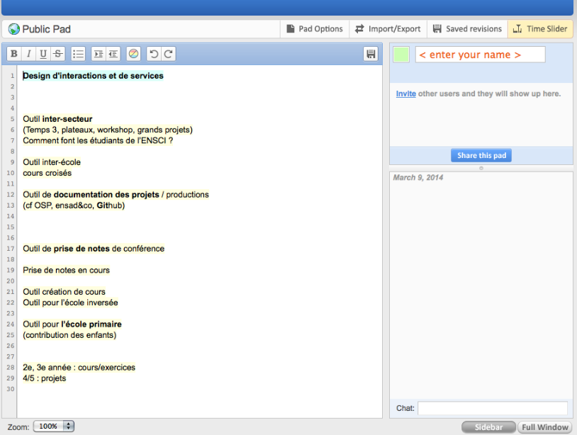

_Capture d'écran de la plateforme etherpad_

Nous pouvons remarquer qu'Internet a favorisé l'émergence de plateformes contributives, ce qui est à la base de la société fluide. Cette nouvelle organisation collaborative est en train de redéfinir le commerce, la politique, l'administration, l'éducation, le design, c'est à dire : le monde entier. L'ambition de la société fluide est de rompre les rapports de forces entre les individus et de permettre des échanges horizontaux entre eux. Ces échanges passent par la contribution, le partage des connaissances, comme le montre les différentes plateformes que nous venons d'évoquer. Ce qui fonde cette société, ce sont les liens, les interrelations, les interdépendances, les équilibres dynamiques, pour développer une société plus participative ou collective. L'intention de cette société émergente est de créer un pouvoir transversal, un pouvoir distribué sur le réseau. Ainsi, de vivre et produire ensemble pour une construction collective de l'avenir. Joël de Rosnay observe que "nous sommes en train de passer du système D au système Co". Une nouvelle organisation ou chacun peut agir pour tous ou travailler en collaboration. Ce qui permet l'apparition d'une Co-économie ou d'une économie de partage.

De plus, Bernard Stiegler observe cette même évolution vers la contribution et il propose, lui aussi, une nouvelle économie fondée sur le partage : la distribution des responsabilités et des ressources grâce notamment aux nouvelles technologies réticulaires. Il remarque la fin de la société de consommation et l'émergence d'une nouvelle société, la société du partage, notamment du savoir et des connaissances. Bernard Stiegler propose un nouveau système économique basé sur l'automatisation. Il affirme que nous sommes en train de nous engager dans une société des automates, les automates sont partout dans notre corps, ils conduisent les voitures. Ainsi l'informatique, par l'algorithme, est un stade dans cette automatisation. Il affirme qu'elle va se généraliser et cela va rendre l'emploi de moins en moins nécessaire. "Regardez les caisses automatiques dans les supermarchés, les automates au péage, mais également les robots logiciels qui font le ménage sur _Wikipedia_. Ce que je soutiens c'est que c'est une bonne chose. À une condition: qu'on valorise la possibilité qu'ont les gens de développer leurs capacités sociales, leur savoir, leur travail au sens fort du terme, plutôt que leur seul emploi." Ainsi, ces systèmes automatiques libèrent du temps pour les citoyens. Et à l'inverse de "Time is money", Time is design : le désir de singularité grâce au temps libéré du travail.  Bernard Stiegler propose une nouvelle société basée sur de nouvelles valeurs, des valeurs sociales telles que l'art et le design et ainsi une nouvelle économie. 
___

#####L'open source pour une création libre

L'open source, où le code source est libre, est au cœur de cette idée idéale de partage. Il y a une dynamique fluide dans l'ouverture d'un programme, une dynamique se crée dans la capacité à pouvoir réutiliser/copier les données et dans la redistribution ensuite par la partage. L'open source est une pratique fluide car elle permet la décentralisation du pouvoir qui est donnée à l'ensemble de la communauté. C'est un pouvoir partagé qui n'a pas une volonté de contrôle car fondé sur des bases décentralisées. Cette capacité de partage, crée de la valeur sans créer forcement du profit, ces valeurs permettent une économie de la connaissance et transforme l'usager en contributeur. Il existe dans l'open source une possibilité d'amélioration par la base, chaque utilisateur peut modifier la partie de code qu'il souhaite.

_GitHub_ est un bon exemple de travail collaboratif, c'est une plateforme qui héberge des projets de développement de plateformes (logiciel, site, application) utilisant le programme _Git_. Ce service reprend le système traditionnel de l'open source en proposant à chaque contributeur de copier les sources du projet d'un autre et de proposer en retour ses modifications à celui-ci. Il s'agit de _forker_ le projet d'un autre membre en rajoutant une _branche_ à l'arborescence de son projet. Visuellement sur le site, chaque projet possède l'arborescence de son évolution. Les utilisateurs _versionnent_ leur travail, c'est à dire qu'ils enregistrent des sauvegardes successives à différents moments de leur production. Ces différentes versions permettent à la communauté de modifier une partie du projet et ensuite de la proposer au créateur d'origine qui est libre d'intégrer cette modification à son projet. _GitHub_ est un modèle de communauté qui échange, partage dans la création. Cette plateforme propose aussi un système de réseau social entre les membres, qui peuvent discuter, échanger entre eux.

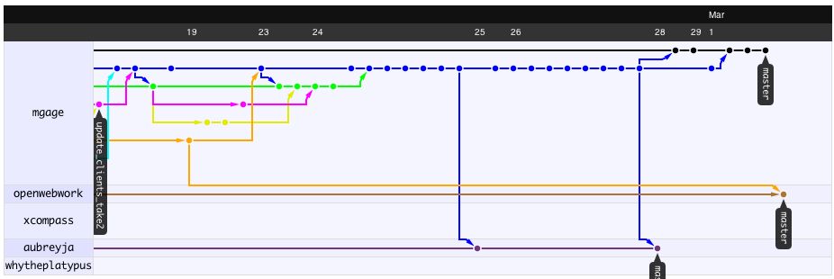

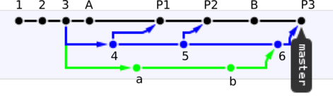

_Fork sur Github_

Cette notion de collaboration dans la création me parait tout à fait pertinente dans l'élaboration d'un design fluide. Le magazine _Wired_ propose un article sur les détournements de _GitHub_ à des fins de production dans le design. La plateforme est en train de s'ouvrir à des projets de design "Git Hub veut rendre la collaboration sur le design 3D et sur l'impression aussi facile qu'elle l'est avec le code." ("GitHub wants to make collaborating on 3-D Design and printing as easy as collaborating on code.") 

	[ à developper " "How the collaboration platform aims to help everyone do any projects" ]

Il y a des outils intéressants qui sont en train de se mettre en place, des outils qui privilégient la collaboration à une échelle importante, il me semble que ce sont des ressources très riches pour la création de demain. Nous pouvons observer l'immense production de savoir permis par _Wikipedia_ et il est intéressant d'imaginer cette même contribution pour la création et le design. Nous pouvons nous demander si ce genre de contributions à grande échelle est possible dans le design, est ce qu'une plateforme de partage dédiée au design pourrait permettre de décupler les impacts de celui-ci ? Cependant, nous pouvons nous interroger sur le fait que les designers aient envie de contribuer à une communauté. Nous observons dans le milieu du design une augmentation des revendications d'auteurs. Le design d'auteur est un design très séduisant, très proche de la position de l'artiste, il est une quête de réalisation de soi par sa production. 

	[Typographie libre / contribution pour la communauté Raphaël Bastide]
___

Personnellement, la pratique d'auteur ne me semble pas antagoniste avec l'idée de contribution. Bernard Stiegler démontre que la contribution permet l'individuation, en contribuant à des projets je me développe en tant qu'individu.
___

En se fluidifiant, en partageant, je pense que les designers peuvent conjointement augmenter le potentiel du design ainsi que leur développement personnel. En permettant aux internautes de copier ce que je fais, je permets une fluidité des idées.
___

Les graphistes belges du groupe _Open Source Publishing_ travaillent autour de ces questions d'open source et de contribution. Ils utilisent leur site Internet comme une plateforme de contribution. Leurs projets sont fait pour être copiés, ils sont en attente de développements contributifs : ils diffusent leurs fichiers sources qu'ils nomment "ingrédients". Ils nous incitent à "étudier, améliorer, redistribuer des copies, transmettre nos améliorations" (" We warmly welcome you to study them, improve them, to redistribute copies of them and release your improvements (or unstable versions as you like).") 

	[ à développer ]

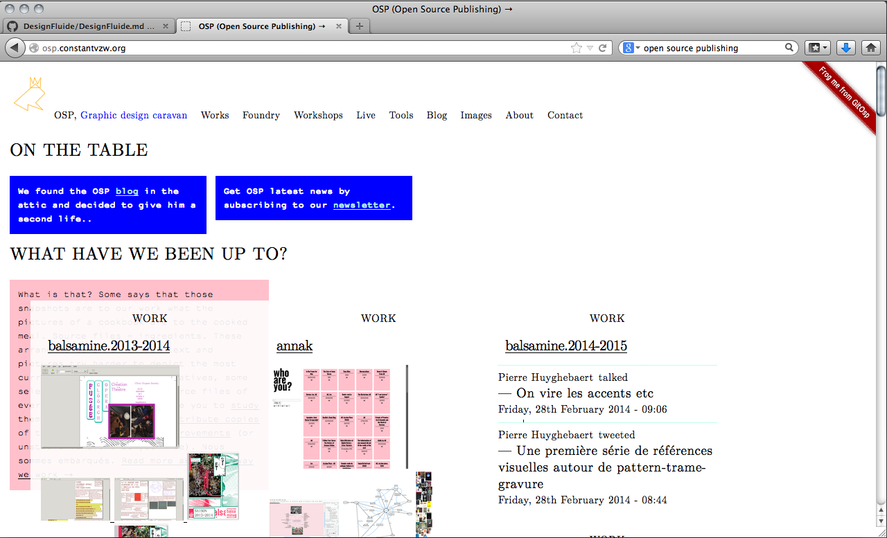

_Site d'Open Source Publishing_
___

#####Des licences libres pour une création fluide

Ces idées et possibilités sont passionnantes et stimulantes, cependant, la copie n'est pas toujours légale et elle est souvent confrontée aux questions de droit d'auteur et de copyright. Cette duplication généralisée est à la fois la force d'Internet mais cela pose en contre partie des problèmes d'éthiques en termes de création. Cette capacité de copie remet en cause la notion d'unicité d'une œuvre d'art. 
___

Dans "l'œuvre discrète", Eric Watier nous montre que "jusque-là une œuvre de l’esprit avait nécessairement un support physique fixe". Effectivement nous l'avons vu, le principe du design solide est de produire des formes figées dans le temps. De ce fait, "le droit d’auteur protégeait l’originalité d’une idée grâce à l’originalité de son inscription dans une forme. Les deux étaient inséparables." Or, le support à évolué, il est devenu fluide, liquide: il y a une différence entre le code et le support (toujours différent) qui accueillera la création. "Pour profiter d’un objet numérique, il faut le réactiver." "Si au début du XXe siècle c’était encore la reproduction d’un objet qui provoquait sa consommation, aujourd’hui c’est le désir de consommation d’un objet qui va provoquer sa reproduction : pour consommer il faut reproduire." Eric Watier explique d'autre part que le téléchargement ne prive personne, il ne retire aucun objet. Au contraire, il en crée un supplémentaire. "Il provoque la réactualisation d’un objet par l’édition d’un objet supplémentaire". De ce fait l'industrie parle de vol là où il s'agit de production supplémentaire, de copie. Et l'auteur pose une question essentielle: "Comment penser l’économie d’un objet si sa consommation n’est plus son épuisement mais sa prolifération ?"
___

Ces volontés de partages sont antinomiques avec les licences et les brevets traditionnels. Les notions de liberté de duplication sont au centre des nouveaux enjeux de société. Est-ce que cette notion de copie est viable dans la création? Il existe déjà des nouveaux systèmes de licence comme le "creative commons" qui est une organisation qui propose une alternative au "droit de propriété intellectuelle". Son slogan: "partager, remixer" explique bien l'idée selon laquelle il souhaite faciliter la diffusion et le partage. 

Ainsi, ce passage de mains en mains dans la création nous renvoie à un design liquide, un design fuyant. Pour que le design soit fluide, il faut briser son idée d'unicité. Tant que la création sera vue comme un objet ayant une forme unique, cette création sera solide et inadaptée au media Internet. Une création en adéquation avec Internet est une forme capable d'être partagée et modifiée à l'infini. Une forme qui coule et évolue suivant les évolutions qu'elle subit. Lawrence Lessig explique, dans _L'avenir des idées_, l'importance des ressources libres et des biens communs ; "les ressources libres ont toujours été un élément clé de l'innovation". "Il estime que le "partage légal" et la "réutilisation" de la propriété intellectuelle sont des bienfaits pour la société." Le copyleft est une alternative au copyright, l'auteur autorise par le copyleft, l’utilisation, la modification, l'étude, la diffusion de son œuvre. Le copyleft est popularisé par Richard Stallman. 

La possibilité de copie est le meilleur moyen d'assurer l'ouverture. Internet en tant que réseau transparent et neutre est un support pour les libertés des individus. En appliquant ces mêmes notions de transparence et de neutralité à un autre médium comme les logiciels nous permettons d'en assurer la liberté.

D'autre part, le virus informatique est basé sur cette idée de duplication insatiable, il est lâché dans le cyberespace et la réplication devient son moteur le plus puissant.  Cette capacité de duplication permet une fluidité d'échange entre les hommes et elle améliore le partage.
___

## Propagation de l'information, prolifération des données

#####Emergence d'une communication fluide par l'intelligence collective et l'auto-organisation des internautes

Comme nous venons de le développer dans le paragraphe précédent, le copier/coller est une des actions caractéristiques d'Internet, il a permis aux utilisateurs de partager des informations et des objets et ainsi de créer des systèmes de contributions. La copie génère un principe de mouvement, de dynamisme. Il y a un mouvement fluide qui est permis par l'action de prendre, de modifier, et de redistribuer. Il y a une mise en mouvement des choses par l'imitation.

Cette duplication à l'échelle de l'ensemble des internautes, rend le web animé. Nous avons l'impression qu'Internet fonctionne comme un organisme vivant, c'est dû à la somme des actions de chaque internaute. En cliquant, dupliquant, naviguant ils rendent cet espace actif. C'est cette notion de multitude qui crée de la valeur sur Internet, "plus il y a de contributeurs, de relations créées, plus internet sera riche de ressources." (L'alchimie des multitudes PISANI)

Ainsi "un grand groupe de personnes peut créer une œuvre collective dont la valeur dépasse de loin celle que peut produire n’importe quel participant individuel ". Cette idée est appelée _crowdsourcing_ ou _intelligence collective_. Elle est très présente sur Internet, elle est à l'origine de projets ou de plateformes. Wikipédia est un bon exemple d'intelligence collective, la somme des connaissances de chacun a permis de créer une encyclopédie universelle, multilingue proposant des articles sur presque tous les sujets. James Surowiecki explique dans son livre _La sagesse des foules_, comment les foules sont, dans un certain contexte, plus intelligentes que les experts. Cette nouvelle capacité distribuée est caractéristique d'Internet, elle est une composante importante de la société fluide. Thierry Crouzet observe dans son livre "le peuple des connecteurs" la façon dont les utilisateurs d'Internet s'organisent en l'absence de chef. Les internautes en tant que web-acteurs agissent sur le web. "Nous assistons à une appropriation du web par les Webacteurs connectés les uns aux autres en réseau." (L'alchimie des multitudes PISANI).

Cette idée de _crowdsourcing_ est largement répandue, des sites comme _Kick Starter_ ou _KissKissbangbang_ utilise ce système pour financer des projets. Il s'agit de plateformes qui veulent lancer financièrement des projets grâce à la contribution de chaque Internaute. Les investisseurs sont des particuliers qui investissent un petit montant et c'est la somme des contributions qui permet le lancement du projet. Dans le cas de financement participatif, cela s'appelle _crowdfounding_.

Ce qui m'intéresse plus particulièrement dans l'intelligence collective, c'est la façon dont les internautes façonnent la communication sur Internet. De la même manière que le crowdsourcing, par la somme de leurs actions, les internautes influencent les mouvements d'information. Les informations sur Internet subissent donc des modifications par la copie, la sélection ou le commentaire. Les internautes sont de plus en plus impliqués dans la transmission du contenu. Par exemple, sur _Twitter_ l'utilisateur choisit les flux d'informations qu'il veut suivre. De plus, il a accès à la diffusion d'informations, il est à la fois le consommateur et le producteur. "Les "cascades d’informations" retweetées propagent les flashs d’information à travers tout Twitter en un instant, ce qui en fait la première source de prise de connaissance de l’actualité pour de nombreuses personnes." (Traduction par XX du texte de Tim O'Reilley : Web squared: Web 2.0 Five Years On 2009)" 

	[ex: hashtag # - créé par la communauté // ex: La constitution islandaise construite ne crowdsourcing. ]

#####Création d'un langage fluide par la mémétique

Nous allons voir en quoi la communication d'Information a évolué, dû aux actions infinies des internautes, en quoi l'intelligence collective à modifié la communication. Premièrement, je souhaiterais faire un parallèle avec la _mémétique_, définie par Richard Dawkins en 1976 dans son livre le "Gène égoïste", puis reprise et étudiée par Susan Blackmore. L'étude de la mémétique est l'observation de l'évolution des informations et des cultures qui survivent ou se répandent comme le fait la génétique, par la sélection naturelle. La mémétique inclut l'extinction, la propagation et la mutation de ces éléments de culture. La mémétique se base sur la notion de _mème_, terme formulé par Richard Dawkins. Le _mème_ définit ce qui est imité. Ainsi, la _mémétique_ reprend le principe de la théorie de l'évolution de Darwin et l'applique à des éléments de culture comme les codes, les schémas informationnels, les comportements, ... De la même manière que les espèces subissent une sélection naturelle par leur reproduction, les choses que nous imitons subissent elles aussi une sélection. Susan Blackmore explique qu'il y a mémétisme quand il y a copie avec variation plus sélection. Elle montre que l'imitation entraine la création de design émergeant de nulle part. On ne peut pas l'arrêter. Ainsi, toute information qui est modifiée et sélectionnée va produire de la création ("any information that is varied and selected will produce design"). Elle explique comment la _mémétique_ crée de l'intelligence : c'est en nous imitant que nous créons des comportements, des religions et notamment des langages.
___

Ainsi, est-ce en se copiant les uns les autres que les hommes ont développé des langages. Nous pouvons penser qu'Internet en tant qu'espace hautement mimétique (grâce à la copie et à l'intelligence collective) est un espace qui crée un nouveau langage : un nouveau système de communication fondé sur la duplication. L'exemple principal de ce nouveau langage est le _mème Internet_, reprenant le terme de Dawkins. Les mèmes sont des unités de culture ou de comportements qui survivent et se propagent par l'imitation et l'adaptation. L'Oxford English Dictonnary définit le mème comme étant: "un élément d'une culture pouvant être considéré comme transmis par des moyens non génétiques, en particulier par l'imitation". Ainsi, sur Internet une nouvelle forme de communication est née, une communication par la **propagation**. Les informations sur Internet sont en permanence dupliquées, c'est par ces copies qu'elles se déplacent dans le cyberespace. La copie, dans la durée d'un même élément, provoque sa propagation, sa duplication en chaîne entraine une idée de mouvement, de prolifération. Les _mèmes internet_ errent sur le web de manière fluide, au grès des courants, ils sont copiés, amplifiés, détournés. La duplication leur donne de l'importance. Plus une image est vue, plus elle sera dupliquée. Ce sont des petites portions de culture de l'air du temps. Les trois qualités d'un _mème_ sont la _longévité_, la _fécondité_, et la _fidélité_ de ses copies. Les _mèmes_ ont tendance à être plus efficaces s’ils sont à la fois copiés et imités. ("Memes tend to be most successful if they get both copied and imitated")

De la même manière que les espèces subissent la théorie de l'évolution, l'information est auto-sélectionnée par les mouvements de mass média, ainsi certaines informations perdurent pendant que d'autres s'éteignent. 

	[ auto-organisation - auto gestion sur Internet Thierry Crouzet - Le peuple des connecteurs. ]

Susan Blackmore explique que la théorie de l'évolution de Darwin est basée sur l'idée: "*Si* il y a des créatures qui varient, *si* il y a une combat pour la vie, et *si* certaines créature survivent, *alors* c'est qu'elles doivent être mieux adaptées que leurs parents". Ce que Susan Blackmore veut souligner c'est l'idée de *si, si, si, alors*. Darwin avait ainsi décrit le principe d'un algorithme avant même sa création. 

D'autre part, Pierre Levy explique dans _l'intelligence collective_, les évolutions de la communication. Avant les médias imprimés, la communication se faisait par la parole, ce sont des échanges fluides car ils impliquent le corps et le geste; par exemple, la parole est basée sur un système d'interaction. Selon l'auteur, les medias imprimés ont figé la communication: "les technologies médiatiques fixent et reproduisent les messages" pour atteindre un public très large : la masse. Ils ont une échelle bien plus grande que les media "somatiques" (parole, danse...) "Mais, ce faisant, ils les décontextualisent et leur font perdre la capacité qu'ils avaient de s'adapter aux situations lorsqu'elles étaient émises par des corps vivants." Nous avons défini dans l'introduction les médias imprimés comme étant solides. C'est ce que Pierre Lévy explique lorsqu'il dit que "dans le communication écrite traditionnelle, toutes les ressources du montage sont employées au moment de la rédaction. Une fois imprimé, le texte matériel garde une certaine stabilité…" Cependant, l'auteur explique que Internet, en tant qu'espace d'interaction et d'échange, permet une communication "vivante". Selon lui, on retrouve dans le cyberespace cette notion d'échange et de fluidité des informations. "Le cyberespace tend à reconstituer sur une plus grande échelle le plan lisse, le continuum individus, le bain vivant et fluctuant qui unissaient les signes et les corps, comme les signes entre eux avant que les médias n'isolent et ne fixent les messages." Ainsi, la communication sur Internet par ses interactions est une communication fluide. C'est une communication dans le mouvement et dans l'espace, un nouveau langage fluide qui permet une communication virale. "Le numérique autorise la fabrication des messages, leur modification et même l'interaction avec eux, atome d'information par atome d'information, bit par bit".
___

#####Propagation des informations: Un design fluide aux propriétés virales

Selon Metahaven, "L'action politique au 21ème siècle a dépassé le manifeste. Pour atteindre une taille critique, il déploie de nouvelles stratégies avec des propriétés virales et des compétences de survie darwinienne". ("Political action in the 21st century has moved beyond the manifesto. To achieve scale, it is deploying new strategies with viral properties and Darwinian survival skills."). La remarque de Metahaven est très pertinente, et je souhaiterais développer cette idée pour le design graphique, que la viralité et la propagation soit l'essence du graphisme de demain : du design fluide. 

De ce fait, il serait intéressant de développer un design aux propriétés virales. Le design fluide doit suivre l'extrême fluidité des _mèmes_, c'est à dire rentrer littéralement dans le cyberespace et se laisser ballotter au gré des courants. Metahaven se demandent au début de leur livre, si la dernière chose que le design graphique doit faire serait de se poster lui-même sur Internet ? ("Is it possible that graphic design has only one thing left to do, which is posting itself on the Internet ?") 

En observant les _mèmes_ et leurs évolutions dans le cyberespace je remarque que l'information tend à être de plus en plus divisée en petites entités : en unité de pure information. Ainsi, cela transforme la façon dont le design graphique peut créer du contenu. En déposant une unité de création sur Internet, je la dépose à la surface d'un organisme vivant, qui va digérer mon projet. En tant que créateur il est important de comprendre cette fluidité des créations et d'utiliser ces effets dans sa production. Ainsi le designer peut se positionner comme un lanceur de vaisseaux de design à travers Internet et observer par la suite ce que ces vaisseaux deviennent. Le designer peut créer du contenu sous forme de petites unités inspirées des _mèmes_ et distiller ces entités de création une à une sur Internet. Il est peut être intéressant de subdiviser nos créations en unité, comme des _mèmes_, pour leur permettre de se propager sur Internet. Ce goutte à goutte de création va se mélanger au déluge de données qui compose déjà l'Internet.

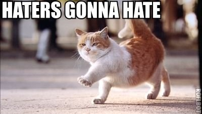

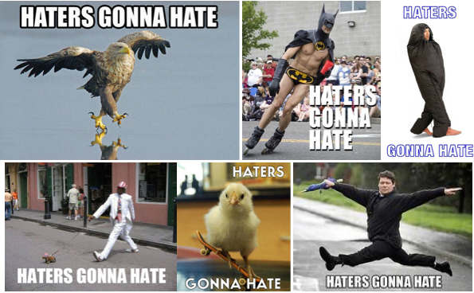

_Mèmes Internet : Haters gonna hate_
___
Un exemple de design fluide, est le projet _Island in the Cloud_ de Metahaven. Le duo de graphistes hollandais a créé un projet autour des nouveaux Datacenter en Islande promus par le groupe _IMMI_ dont Eleanor Saitta et Smari Mc Carthy sont les représentants. Pour ce projet Metahaven a créé une série d'images entre le _mème internet_ et l'affiche, ils ont diffusé leurs images les unes après les autres sur Internet via leur _tumblr_. C'est un projet fluide car ces posters ne sont pas liés entre eux par une plateforme dédiée au projet, ils sont liés entre eux par leur ressemblance, leur mimétisme. Metahaven n'a pas conçu un site Internet, support fixe d'un projet. Ils ont créé des _mèmes_ postés sur _tumblr_ qui vont être copiés, dupliqués de _tumblr_ en _tumblr_ ou de sites en sites. Leurs créations sont des entités uniques, des images uniques, sans liens fixes entre elles, elles sont seulement liées par la ressemblance. Si nous recherchons dans Google Image le nom du projet, l'ensemble des images est rassemblée. Or, chacune d'entre elles indépendamment, informe sur le projet, mais elles forment un tout une fois regroupées grâce à Google Image. Ce principe de communication par la propagation est très fort sur Internet et je pense que les designers graphiques doivent s'en inspirer pour créer de nouveaux systèmes de diffusion de projets ou d'évènements. Qu'est-ce qu'un projet viral, qu'est-ce qu'une création virale? Nous pouvons imaginer des sites Internet qui débordent de leurs frontières. Ou bien, un site Internet qui reste à la surface de mon écran quelques instants après avoir consulté cette page. Il se diffuse. Internet est selon moi un espace liquide qui permet de nouvelles façons d'envisager la communication d'évènements ou de projets.

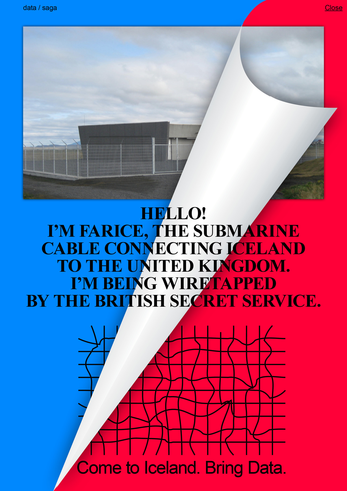

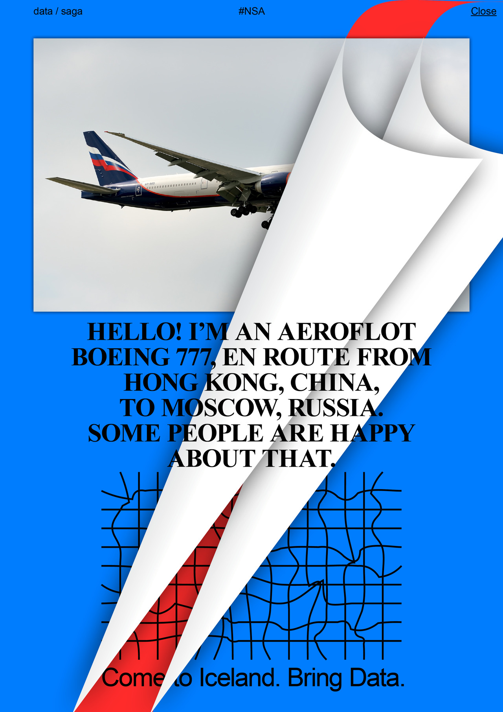

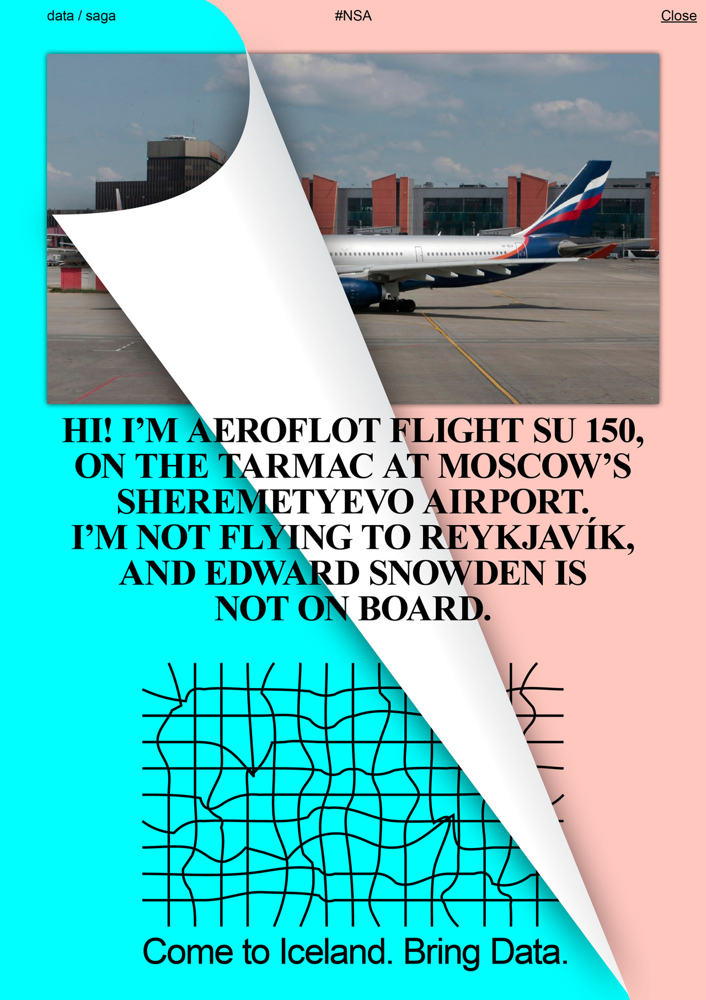

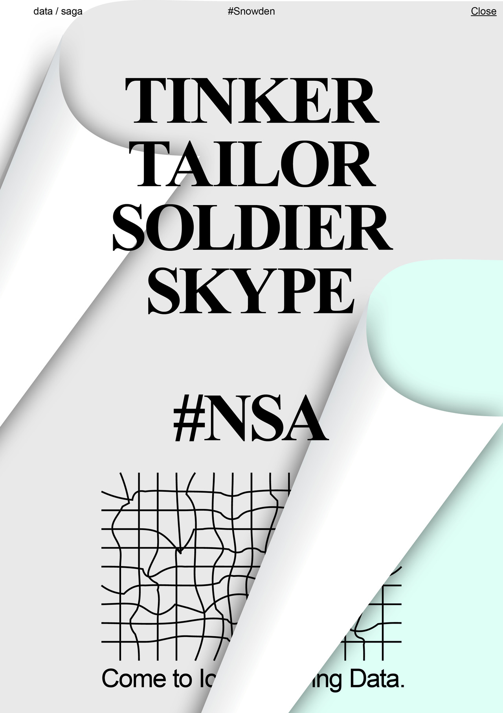

_Projet **Island in the Cloud** de **Metahaven**_ 
___

C'est ici que Google Image peut apparaitre comme un outil particulier. Cette plateforme permet de parcourir Internet à la recherche d'un corpus d'image, autour d'une notion. Nous pouvons imaginer que Google Image est le lieu de regroupement de nos créations subdivisées en cellules de création.
___

## 3. Accompagnement graphique dans l'émergence d'une nouvelle cognition.

	[ Commentaire work in progress : J'ai regroupé récemment les deux dernières parties (3 et 4) en une seule.
	Donc pour le moment cette nouvelle partie n'est pas structurée, c'est encore les paragraphes des 2 dernières
	parties les uns à la suite des autres. L'idée est de parler dans cette partie de l'émergence d'un nouveau
	système de cognition basé sur la sémantique, les métalangages (ex: ieml Pierre Levy) et les métadonnées. De
	ces métalangages et métadonnées je souhaite montrer que l'information se spécialise, elle permet la
	diversité, (donner l'exemple de la "longue traine" de Anderson). Ensuite montrer que l'utilisateur est de
	plus en plus au centre des choses sur Internet. Poser la question de la personnalisation et de la création
	personnalisée. Puis évoquer les recherches de Pierres Levy sur des écosystèmes de pensées. La partie sur la
	surveillance sera surement différente, voir le supprimer.]

#####Le web sémantique

Dans la partie précédente, nous avons vu que la copie rend les informations mobiles sur Internet, elles se déplacent à travers le web par leur duplication. Cette prolifération des informations, est possible car leur contenu est scindé en unités d'informations: en données. Après avoir vu la fluidité des informations dans le mouvement, nous allons comprendre que le web tend à devenir un vaste océan de données fluides. Les données dont nous allons parler sont des unités de contenus qu'il ne faut pas confondre avec la fuite de nos données personnelles qui sont, elles, stockées ou utilisées à des fin commerciales. Dans cette partie, nous nous intéresserons au web _sémantique_. Quel est son potentiel dans l'univers des connaissances ainsi que les enjeux liés au design ?
___

Nous sommes en train d'aller vers un "monde des données", elles deviennent l'essence de la communication et de la connaissance. Une donnée est une unité d'information, la plus petite partie d'information. L'enjeu principal du web de demain est de rendre ces données compréhensibles par les ordinateurs. Le web sémantique n'est pas un nouveau web, il est dans la continuité du web courant, il permettra de mettre un sens sur les informations qui seront comprises aussi bien des ordinateurs que des humains: "rajouter une couche de signification au-dessus du web existant." Nous allons passer d'un web pour être lu à un web ou les informations sont comprises de manière intelligente par les ordinateurs. Le web sémantique cherche à développer les capacités des connaissances en donnant de l'intelligence aux ordinateurs et en leur permettant de comprendre le terme des mots. "L'univers de l'information de demain sera assurément un web de données" conclut Frank van Harmelen.
___

Aujourd'hui, les pages web sont liées entre elles par des hyperliens. Demain, les données au sein de ces documents seront liées entre elles par la sémantique. “Nous allons d’un web de documents connectés à un web de données connectées”, explique Nova Spivack. Ce sont les liens, les relations entre les données qui créent de l'intelligence. Le but du web sémantique c'est de lier les données entre elles pour qu'elles soient utilisables par les ordinateurs et ainsi utiles aux gens. Tim Berners Lee explique dans une conférence TED, l'importance du contenu sous forme de données. Ainsi, Il constate que nous avons déjà mis toutes nos connaissances sur Internet: "tout ce qu'on peut imaginer est virtuellement sur Internet". Tim Berners Lee s'interroge de ce qu'il se passera si nous réussissons à les faire dialoguer. Il explique que ce qui est important ce sont les relations entre les données. Une nouvelle forme de savoir pourra émerger si nous sommes capables de créer des liens entre toutes ces informations. Cette utilisation des données peut décupler les potentiels de connaissances sur Internet par l'association d'idées.

Ce que Tim Berners Lee explique c'est que nous sommes à l'aube d'une potentielle révolution des connaissances. Si nous arrivons à rendre intelligible pour les ordinateurs le contenu qui est sur Internet, par la puissance de calcul, cela permettra une démultiplication des potentiels de connaissance. Il me semble que l'intelligence humaine et numérique sont complémentaires. De la même manière que _Wikipédia_ a transformé le champ des connaissances, le web sémantique peut dynamiter le savoir humain.

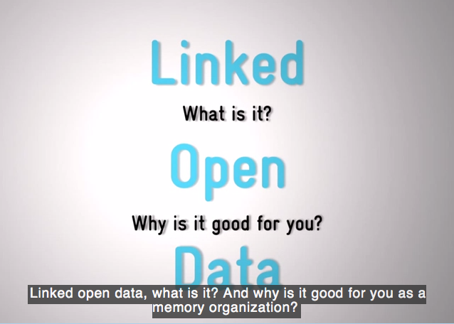

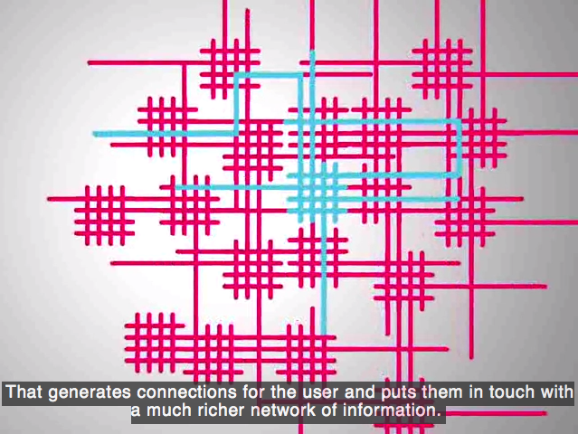

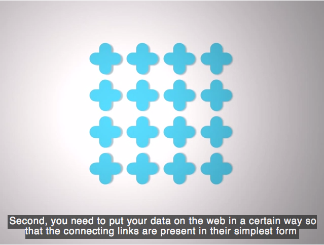

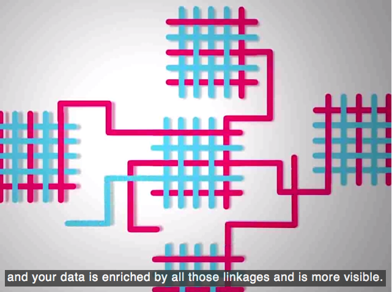

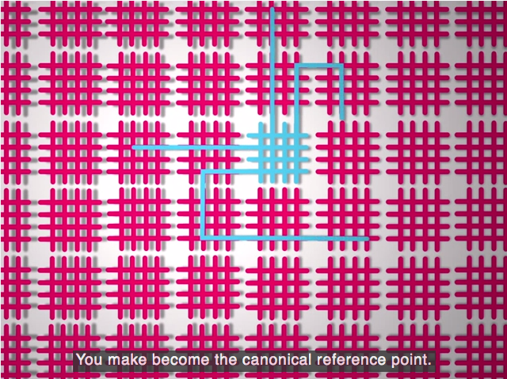

_Vidéo **Linked Data** - Wikipédia_
___

Dans l'article _The Hillis Knowledge Web_, Daniel Hillis évoque une sorte de _database_ qui hébergerait tout le savoir humain et ce réservoir de connaissances serait lisible par les ordinateurs qui analyseraient ce savoir et rendraient par la suite une compréhension utile aux Hommes.

>" if humans could contribute their knowledge to a database that could be read 
>by computers, then the computers could present that knowledge to humans in 
>the time, place and format that would be most useful to them."

Dans la suite du texte, il se pose la question si ce grand réservoir de ressources ne serait pas le World Wide Web. Selon l'auteur, le _knowledge web_ nous rendra plus intelligent.

Ainsi, ce système de web sémantique est-il en train de se développer. Google va mélanger des systèmes de recherches sémantiques avec son système actuel pour mieux identifier les informations intéressantes et les présenter en premier dans leurs résultats de recherche. D'autre part, il affiche déjà, dans certains navigateurs, des faits et des réponses directes à certaines recherches en haut de sa page des résultats. Ainsi nous sommes en train de quitter un web sous la forme d'un catalogue pour aller vers un web _guide_. Il suffira de poser des questions dans un langage courant et Internet nous donnera une réponse. Au lieu de chercher des informations hébergées dans des documents fixes, chaque information sera libre et fluide en tant que telle. Chaque donnée sera un support de connaissances. Ainsi, je ne chercherai plus mes informations au sein d'un document ou d'une vidéo, l'information ressortira en fonction de ma requête. Par exemple, aujourd'hui si je cherche "où se trouve la Tour Eiffel ?" le moteur de recherche me propose des sites avec au sein de ces sites un texte dans lequel l'information se trouve et c'est en lisant le texte que je trouve ma réponse. Avec le web sémantique, le moteur de recherche sera capable de répondre directement "Paris" à ma recherche. De ce fait, ce changement vers des requêtes sémantiques va transformer la façon dont les sites Internet vont être pensés. Des sites internet vont être équipés d'un système de markup qui est généralement invisible dans la couche code. Le markup permet de donner des indications aux ordinateurs au sein d'un texte. En spécifiant par exemple que le mot _Paris_ est un lieu, l'ordinateur pourra _comprendre_ que la tour Eiffel est à Paris.

Pierre Levy, auteur du livre référence : _L'intelligence collective, pour une anthropologie du cyberespace_ effectue des recherches depuis plusieurs années sur l'élaboration d'un métalangage le _ieml_. La sémantique se base sur des métalangages comme le _ieml_, ce sont des systèmes de coordonnées mathématiques et linguistiques. Ieml est un projet de recherche visant à créer une langue artificielle conçue pour être utilisée de manière optimale par les ordinateurs et capable d’exprimer les nuances sémantiques ou pragmatiques des langages naturels. Pierre Levy étant l'un des pionniers dans l'analyse de l'intelligence collective, Xavier De la Porte lui demande, lors d'une émission de _Place de la Toile_ qui lui est consacrée, quelle sera notre utilisation d'internet dans l'avenir ? Selon Pierre Levy, les internautes _iront_ dans des espaces sémantiques, des mondes des idées. À l'inverse de _second life_, ces espaces ne reproduiront pas notre environnement ordinaire en 3D. Ces réseaux de l'intelligence collective mettront en relation les avatars intellectuels des personnes. Les internautes se rencontreront dans ces espaces sous la forme d'esprits, chaque utilisateur aura un écosystème d'idées relié à d'autres écosystèmes de pensées. Ainsi la connaissance sera personnalisée en fonction de chaque individu.
Pierre Levy, imagine un futur ou les objets, les personnes, les lieux seront augmentés d'un écosystème de connaissance, rendu visible par les _Google Glasses_ par exemple. "Dans la civilisation numérique du futur, ce ne sont pas seulement les groupes humains qui se réfléchiront dans des écosystèmes d’idées : chaque personne, chaque œuvre de l’esprit, chaque concept, chaque objet, chaque lieu, chaque événement sera doublé d’un hologramme dynamique figurant l’écosystème d’idées qui le concerne."

___

##### Interfaces fluides pour une web décloisonné

Nous venons de voir, que le contenu va s'affranchir de son support pour exister sous la forme d'entités, de données fluides. Par conséquent, le web va se décloisonner, se liquéfier. Les frontières solides entre les sites Internet vont disparaître. La division de l'information par leurs supports, les pages web vont se dissoudre. Les données n'appartiendront plus nécessairement à un site web, elles seront volatiles, reliées entre elles en fonction de leur sens. Ce sont les liens qui les relient qui sont importants, ce sont eux qui apportent le sens entre ces unités de contenu.
___

"L'explosion dont il est question concerne la bascule des contenus d'un site web d'une internalité à une externalité. Au lieu qu'un site web ne soit un "lieu" dans lequel les données "sont" et vers lequel d'autres sites "renvoient", un site web sera une source de données qui seront elles-mêmes dans de nombreuses bases de données externes, dont celle de Google (GoogleBase). Pourquoi alors "aller" sur un site web quand tout son contenu a déjà été absorbé et remixé dans un flux de données collectif ('collective datastream')."  
Möbius, le web 2.0 et Darwin - Olivier Ertzscheid

Les frontières des sites internet vont disparaître pour donner naissance à un espace fluide et liquide. Les informations se recomposeront selon des recherches spécifiques. Faire une recherche ressemblera à tirer sur un fils qui activera une relation en chaine entre les différentes données. Il y a donc une différence entre les informations brutes qui se trouvent dans les bases de données et la présentation de l'information qui est, elle, dynamique. Ainsi le contenu sera essentiellement sous forme de flux de données. Le contenu se subdivise en petites cellules.
___	

Comme les données ne sont plus rattachées à un support, les pages web se vident de leur contenu. Au point de devenir des formes complément fluides, extrêmement malléables, prêtent à s'adapter à toute sorte de contenu. Nous avons déjà noté que les sites d'aujourd'hui se doivent d'être fluides dû à l’évolution du contenu dans le temps. Cette idée prend de l'ampleur si on considère que le web se décloisonne. Dans l'avenir, nous pouvons imaginer que le site web tel que nous le connaissons n'existera plus. Les informations seront entièrement fluides dans un océan de données. Ces données se regrouperont momentanément selon la recherche. Ce regroupement pourra se faire sur une plateforme unique, comme Google Image pour la recherche de contenu iconographique. Comment créer une architecture pertinente si les formes se doivent d'être extensibles, déformantes. Le design fluide de demain sera un design déformant. Créer une architecture web, c'est créé de la mobilité, de la flexibilité. Les sites internet se transforment en architecture extrêmement malléable. Le métier de design graphique c'est régler les distances, créer des distances fluides, créer des formes étirables.

D'autre part, les choses tendent à s'inverser. Dans le design solide, le graphiste étudie le contenu: quantité d'images, leur nature, sens du contenu et crée des formes en adéquation avec celui-ci. Dans le web de demain si le contenu est fluide, qu'il n'est plus hébergé dans des documents fixes comment créer des architectures adaptées? Comment créer une forme sans en connaitre le contenu ? Ainsi, nous pouvons imaginer une nouvelle façon d'envisager les sites internet et les plateformes. Est-ce que le design fluide de demain serait de créer des architectures malléables dans lesquelles le contenu viendra se loger par la suite. 

De plus, aujourd'hui, nous assistons à l'émergence des _Templates_. Bien que le web sémantique n'existe pas réellement, les clients se tournent vers des sites déjà réalisés. L'architecture est définie avant que l'utilisateur n'y glisse son contenu. Créer un Template c'est créer une forme architecturale pour toute forme de contenu. Or, nous pouvons nous demander est ce que le fond doit guider la forme dans le design fluide ?

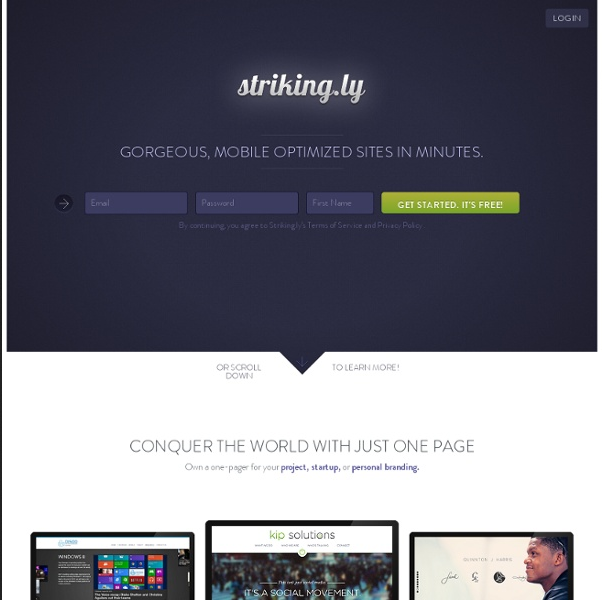

_Strinkingly_
___

Ainsi, nous observons une division dans le travail du graphiste. Dans un premier cas, il peut agir sur le contenu en créant des unités virales qui se déploient sur Internet. Ces créations sont proches d'un acte politique, la parole est au designer. Dans un second cas, il travaille une architecture fluide de site Internet. La mise en page fluide, est une mise en page par la logique et par les systèmes. Ainsi, le design fluide est un design qui n'a pas d'emprise dans le temps.
___

##### Métadonnées et web personnalisée 

D'autre part, la navigation sur Internet est façonnée par les données que nous laissons. En connaissant nos habitudes, Google nous donne des réponses à nos requêtes plus performantes. Par exemple, Amazone à partir de mes recherches me propose des livres en rapport avec mes sujets de recherches. Ainsi, le web est en train de se personnaliser. Nos recherches vont être transformées par des algorithmes prédictifs, de ce fait Google saura avant nous quelles informations vont nous intéresser. Ainsi, notre accès à l'information va devenir complément personnalisé. Aujourd'hui, sans le savoir nous ne regardons pas le même web, chacun voit la page d'accueil d’Amazone en fonction de ses préférences, sans les avoir jamais définis.

Nick Bilton explique dans son livre _I live in the Future & Here's How It Works_ que l'internaute est toujours au centre. Avec Internet nous sommes toujours au centre des choses. "Et ce centre change tout. Il change votre conception de l’espace, du temps et du lieu. Il change votre sens de la communauté. Il change la façon dont vous voyez l’information, l’actualité et les données arriver jusqu’à vous." Il prend l'exemple de la carte, avec _Google Map_ vous êtes toujours au centre de la carte. L'espace s'arrange autour de vous. Le Smartphone vous positionne sur la carte. Et si vous vous déplacez le centre se déplace aussi. C'est un changement par rapport aux cartes papiers qui, elles, organisent l'espace autour de lieux, de monuments. "Mais le monde numérique a changé cela. Désormais, nous sommes toujours au centre de la carte, et c’est un endroit très puissant où être." Ainsi, il explique que nous sommes devenus le centre, "le monde numérique vous suit et pas l’inverse.” L'information que nous consultons est donc "hyper-personnalisée". Ainsi, la jeune génération serait à la recherche de contenus personnalisés, d'expériences personnalisées. Et il ajoute "Pour les créateurs de contenus, cela pose un problème : s’ils ne proposent pas une option pour consommer un produit de manière personnelle." Le client est un "moi au centre" et l'ensemble des activités commerciales est transformé par cette nouvelle position. Est-ce que cela transforme le travail du design ? Je pense qu'il s'agit d'un enjeu intéressant pour le designer fluide. Le designer fluide souhaite que les données soient fluides comme nous l'avons vu dans la partie précédente. Les données fluides dans le cas du web sémantique sont la source d'une révolution des outils de connaissance. Or, est-ce que l'utilisation de données personnelles est intéressante ?

#####Utilisation des données personnelles, création personnalisée

Aujourd'hui, la question de l'utilisation de nos données personnelles est un des enjeux principaux de notre société. Edward Snowden a révélé l'année dernière la collecte massive par la NSA des données des citoyens du monde entier. Nous avons remarqué dans le chapitre précédent que les données sont fluides, or nous pouvons remarquer que certaines d'entre elles sont stockées, archivées (par des états ou des entreprises privées). Elles sont figées dans le temps car collectées en vue d'être utilisées ultérieurement à des fins d'analyses de nos comportements. Ces données sont fixes, solides.
___

Ce stock des données entrave le respect de la vie privée. Les entreprises récoltent des informations sur nos comportements, les entreprises privées gardent des informations que nous ignorons de nous-même. Ainsi, l'un des combats par rapport à ce stockage massif est-il de récupérer les droits sur nos données. Pour le moment, nous n'avons pas de droits sur nos propres données personnelles, il y a des licences qui sont en trains de s'élaborer pour réguler ces pratiques. Thomas Saint-Aubin travaille sur des licences qui permettent aux utilisateurs d'avoir l’accès et la propriété de leurs données, il a nommé ces initiatives "design you privacy" = concevez votre vie privée.

D'autre part, Julien Assange et Jacob Appelbaum énoncent, dans _Menaces sur nos vies privés_, les dérives de la surveillance. Si la surveillance par les états a toujours existée, les Smartphones sont devenus les mouchards les plus puissants jamais inventés. Sans nous en rendre compte, nos actes sont entièrement observés. Les métadonnées donnent des informations très précises de nos faits et gestes. Ces informations sont par exemple, notre position géographique. C'est à dire où nous nous trouvons, où nous allons quotidiennement. D'autre part, il s'agit de nos comportements sur Internet: les sites internet que nous consultons, les textes que nous lisons. Ces informations peuvent rapidement former un portrait-robot de ce que nous pensons.

Tant que les données sont fluides, il me semble que le designer peut les utiliser. Le moment où ces données ne sont pas fluides, c'est lorsqu'elles sont figées, stockées par des entreprises et utilisées à l'insu des utilisateurs qui n'ont plus de droits sur leurs données. Donc est-il intéressant d'utiliser les données personnelles ? Oui, si elles restent fluides et si elles n'appartiennent pas à aux entreprises mais aux utilisateurs.

Nous allons envisager dans cette partie les enjeux d'un design personnalisé. Nous l'avons vu, Internet tend à devenir un média personnalisé, quelles sont les conséquences dans la forme ?

L’utilisation des métadonnées nous permet de produire des formes qui auront un affichage différent pour chaque individu. En programmant des formes créées en fonction des informations de l'utilisateur, nous permettons au designer de programmer une infinité de formes. L'intérêt est de trouver des formes pertinentes en fonction de l'utilisateur soit en lui plaisant, mais aussi, peut être en lui déplaisant volontairement. L’utilisation de ces données peut être un moyen de révéler ou de démontrer à l'usager les informations que nous pouvons utiliser: pour ou contre lui. Dans cette idée de design personnalisé, le travail du design se fluidifie par la multiplication exponentielle des formes qu'il crée. Ainsi, il crée un système unique qui aura une infinité de facettes différentes. Une équation très connue dans les arts graphiques est 1+1=3 soit une image plus une image équivaut à trois images. La troisième image née du sens formé par l'union des deux premières. Aujourd'hui, l'utilisation de données dans la création nous permet d'arriver à la création de l'infini, l'équation deviendra 1=∞. Cela nous permet de comprendre l'idée d'un design complètement éclaté, fluidifié dont la forme évolue premièrement par l'imitation des internautes mais aussi par l'intervention des informations de l'utilisateur.

## Conclusion
___

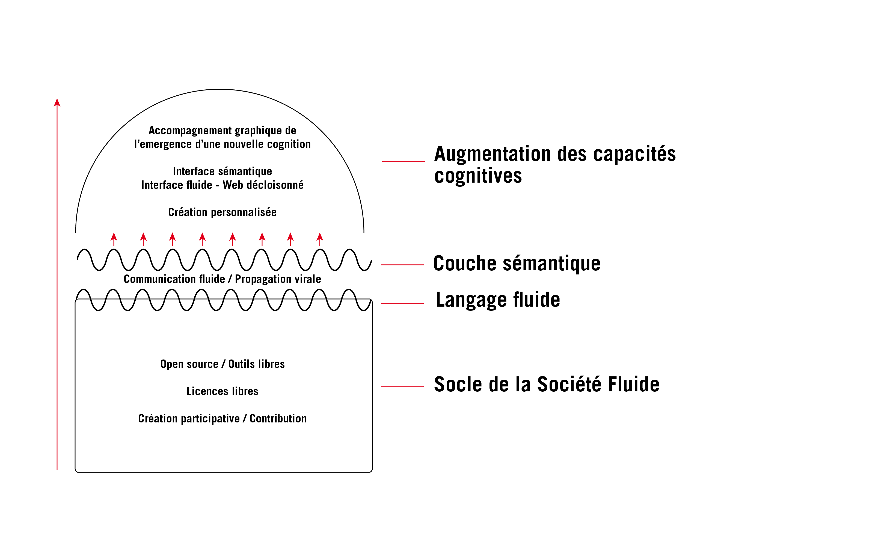

_Schéma des enjeux du design fluide_

La première partie définit la base de la société fluide : l'idéologie du partage est le socle de la société fluide, c'est sa base. La liberté des échanges et la contribution sont les piliers de la société fluide. C'est la première marche vers un design fluide. Le designer fluide est un designer libre qui crée de manière ouverte pour la communauté dans la volonté d'augmenter les capacités du savoir. 
C'est sur ce socle libre et ouvert qu'un nouveau langage basé sur la duplication et l'auto-organisation a pu se développer. L'activité des internautes rend la communication fluide. La capacité hautement mimétique d'Internet a permis l'émergence d'une nouvelle culture fluide ou les internautes agissent sur ce contenu sous la forme de masse. De ce fait, les informations se subdivisent en unités d'informations, qui se déplacent dans le cyberespace de manière virale comme le font les _mèmes_.

Sur ce langage fluide et scindé en cellules d'informations, se dépose une couche sémantique. De ce nouveau système d'interactions entre les données émane une nouvelle capacité cognitive capable de révolutionner l'accès aux connaissances et aux informations. Les métalangages et les métadonnées vont modifier la façon dont l'information sera organisée: elle sera de plus en plus spécialisée et personnalisée. Les frontières entre les sites internet vont se supprimer, les informations seront fluides sous forme de données dans le cyberespace 

Il me semble que l'enjeu principal du designer réside dans la compréhension graphique de ce nouvel environnement de connaissances fluides et ainsi d'accompagner le développement de ces nouveaux langages et de ces nouvelles capacités cognitives. Le web sémantique ne pourra exister que s'il existe une interface graphique. Et cette interface reste à définir. Il me semble que le rôle imminent du designer fluide est de produire ces objets graphiques. 

